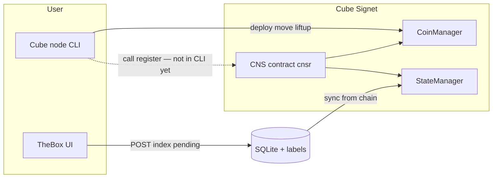
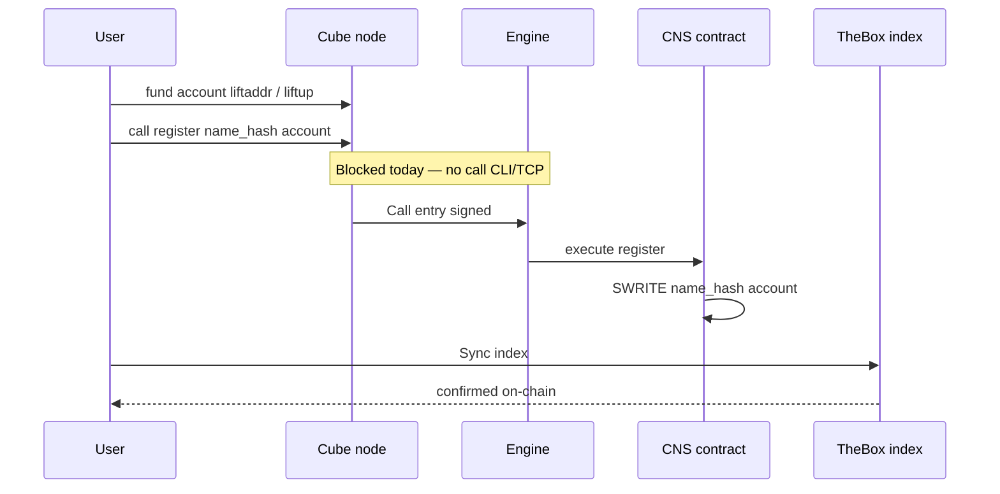
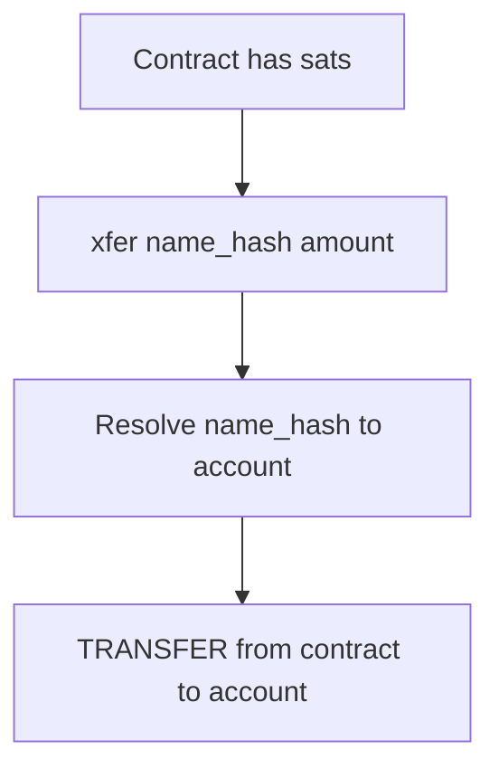
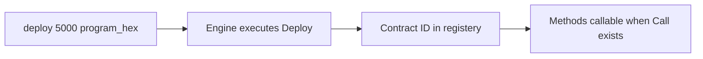
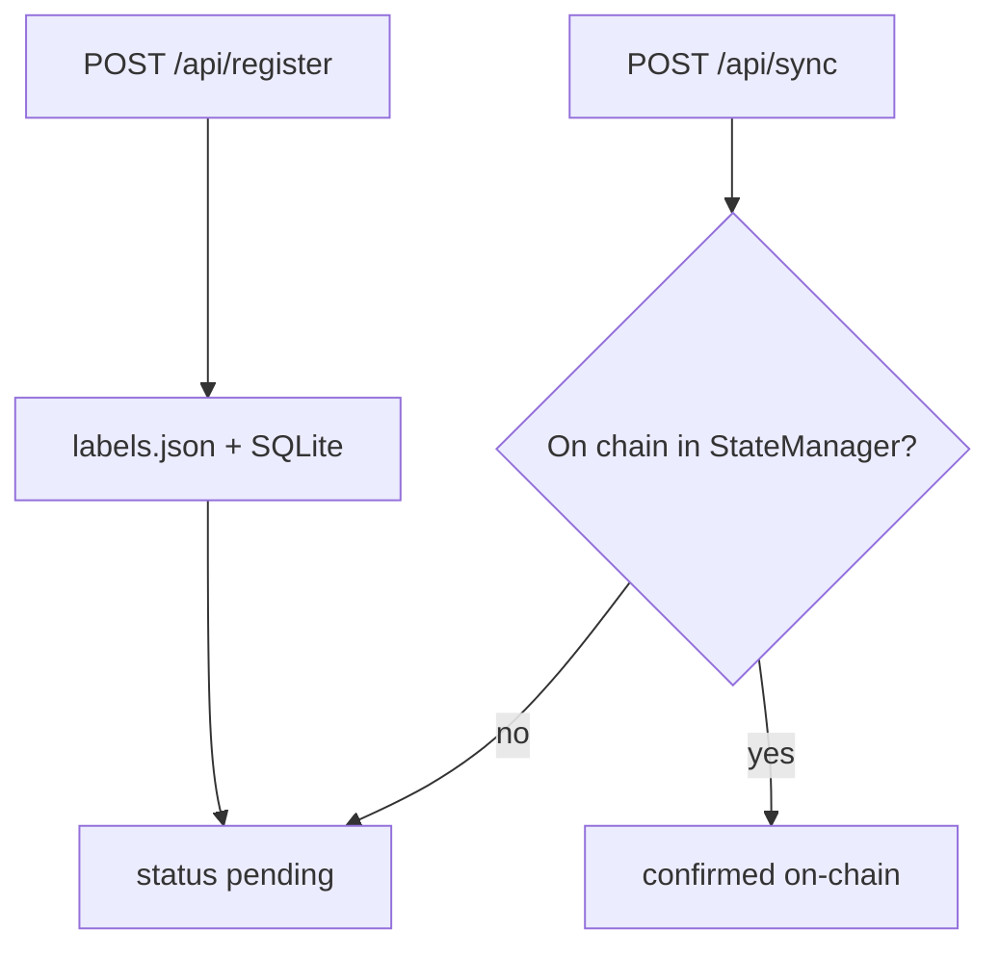

# CNS contract flow

How the **cnsr** program on Cube Signet maps `.cube` names to accounts, and how TheBox fits in.

## Architecture (high level)



## Register flow (intended, on-chain)

1. **Name** → `name_hash = SHA-256(lowercase name)` e.g. `david.cube`
2. **Call** `register(name_hash, account)` on the deployed CNS contract
3. **StateManager** stores `name_hash → 32-byte account key`
4. **TheBox** `POST /api/sync` reads chain state → status **on-chain**



## What works today vs TheBox “pending”

| Step | Cube CLI today | TheBox |
|------|----------------|--------|
| Create identity | `gensec` / import nsec | Generate / Import |
| Fund account | `liftaddr`, `liftup` | Guide + optional SysMon relay |
| Deploy CNS program | `deploy 5000 0x…` | Deploy hint / node relay |
| **Register name on-chain** | **No `call` yet** | **Index only → pending** |
| Resolve name | Via contract when on-chain | `/api/resolve`, names table |
| Pay name from contract | `xfer` (needs on-chain register) | Transfer API hints |

## Contract methods (`cnsr`)

| Index | Method | Input | Effect |
|-------|--------|-------|--------|
| 0 | `register` | `bytes32 name_hash`, `account` | Map name → owner account |
| 1 | `resolve` | `bytes32 name_hash` | Read owner or false |
| 2 | `renew` | `bytes32 name_hash`, `account` | Change owner |
| 3 | `xfer` | `bytes32 name_hash`, `u32 amount` | Contract pays resolved account from contract balance |
| 4 | `balname` | `bytes32 name_hash` | Balance of resolved account |
| 5 | `selfbal` | — | Contract sat balance |

Method indices and contract ID live in `artifacts/program.json`.

## Transfer flows

### A. CNS contract pays a name (`xfer`)



1. Deploy contract with `initial_balance` (e.g. 5000 sats).
2. Optional: send more sats to contract address.
3. `xfer(name_hash, amount)` — debits contract, credits name owner.

### B. Account-to-account (`move`)

Not via CNS contract — from **your** Cube account:

```
move <amount> <to_account_hex>
```

TheBox can show this hint after resolving a name.

## Deploy flow (one-time per network)



Example deploy line is in `artifacts/program.json` → `deploy_example`.

## TheBox indexer flow (off-chain label)



Pending means “saved in TheBox”; it does **not** mean the name is secured on-chain.

## Related docs

- [CNS reference](./CNS.md) — API, opcodes, storage
- [On-chain registration](./ONCHAIN-REGISTER.md) — david.cube / satoshi.cube walkthrough
